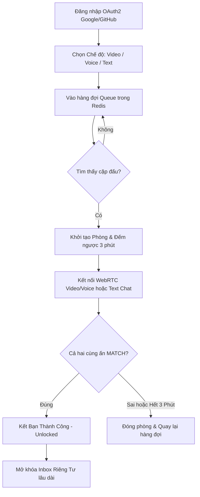
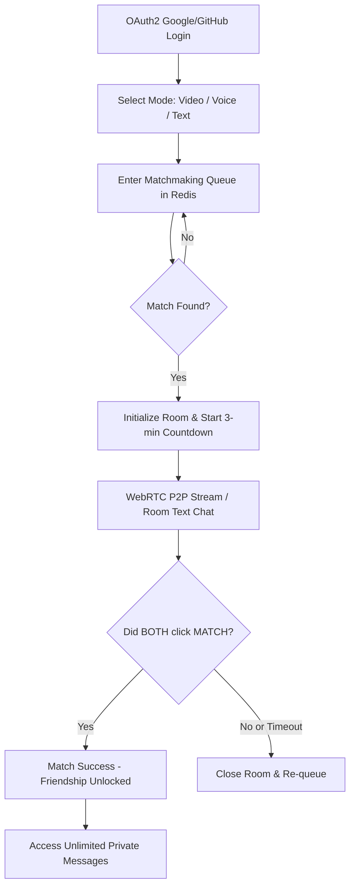

# mitmit - 💬 Live Chat & 3-Minute Blind Date Web App

[](https://www.oracle.com/java/)
[](https://spring.io/projects/spring-boot)
[](https://react.dev/)
[](https://vitejs.dev/)
[](https://tailwindcss.com/)
[](https://github.com/pmndrs/zustand)
[](https://webrtc.org/)
[](LICENSE)

A modern, real-time communication platform combining the random pairing of OmeTV with the matchmaking mechanisms of dating applications.

Nền tảng giao tiếp thời gian thực hiện đại, kết hợp cơ chế ghép cặp ngẫu nhiên của OmeTV và cơ chế Matching của các ứng dụng hẹn hò.

---

## 🌎 Ngôn ngữ / Languages
- [Tiếng Việt (Vietnamese)](#tiếng-việt-vietnamese)
- [English](#english)

---

# Tiếng Việt (Vietnamese)

## 1. Tổng Quan Dự Án
**mitmit** là nền tảng giao tiếp trực tuyến thời gian thực (Real-time Communication) cho phép người dùng kết nối ngẫu nhiên thông qua Video, Voice và Text. Điểm đột phá của hệ thống là cơ chế **"Blind Date 3 Phút"**:
- **Ẩn danh & Giới hạn:** Các cuộc trò chuyện ban đầu bị giới hạn thời gian (180 giây) và ẩn danh một phần để tạo sự thú vị.
- **Quyết định (The Match Decision):** Trong 3 phút đếm ngược, cả hai bên phải nhấn vào nút "Trái tim" (Match) để bày tỏ sự đồng thuận.
- **Mở khóa tình bạn (Friendship Unlocked):** Nếu cả hai cùng Match, giới hạn 3 phút sẽ biến mất, hệ thống tự động kết bạn và mở khóa cuộc trò chuyện riêng tư (Private Inbox) không giới hạn.
- **Ngắt kết nối tự động:** Nếu hết 3 phút mà không đủ 2 lượt Match, hệ thống tự động đóng phòng và đưa người dùng trở lại hàng chờ.
- **Yêu cầu định danh:** Ứng dụng yêu cầu bắt buộc đăng nhập (OAuth2 Google/GitHub) để duy trì sự an toàn và văn minh của cộng đồng.

---

## 2. Luồng Người Dùng Cốt Lõi (Core Workflow)



---

## 3. Các Tính Năng Chi Tiết

### 3.1. Xác Thực & Định Danh (Auth & Identity)
- **OAuth2 Login:** Đăng nhập an toàn qua tài khoản Google hoặc GitHub.
- Không hỗ trợ tài khoản Khách (Guest) nhằm ngăn chặn hành vi quấy rối ẩn danh vô trách nhiệm.

### 3.2. Phòng Ghép Ngẫu Nhiên (Random Chat Room)
- **3 Chế độ giao tiếp độc lập:** Video Chat (WebRTC), Voice Chat (WebRTC Audio Only), và Text Chat.
- **Live Chat đa nhiệm:** Trong phòng Video/Voice có tích hợp khung chat text song song. Tin nhắn trong phòng tạm thời được lưu trữ siêu tốc trong Redis và tự động hủy khi phòng đóng.
- **Đồng hồ đếm ngược:** Đếm ngược 3 phút (180s) được đồng bộ hóa thời gian thực giữa hai client qua WebSocket.

### 3.3. Hộp Thư Trò Chuyện Riêng Tư (Private Messaging)
- **Inbox bạn bè:** Chỉ hiển thị những người dùng đã Match thành công.
- **Tin nhắn đa phương tiện:** Hỗ trợ văn bản, gửi hình ảnh, và ghi âm tin nhắn thoại (Voice note).
- **Tương tác nâng cao:** Thả Emoji reaction, thu hồi tin nhắn (Unsend) từ cả hai phía, hủy kết bạn (Unfriend) hoặc chặn (Block) đối phương.

### 3.4. Hệ Thống Khảo Sát Trải Nghiệm (User Feedback Loop)
- **Đo lường mức độ hài lòng:** Tự động kích hoạt biểu mẫu đánh giá ngay sau khi người dùng đạt số lượng Match thành công nhất định.
- **Chu kỳ hiển thị:** Lần đầu tiên sau **3 lượt Match**, và lặp lại định kỳ sau mỗi **10 lượt Match** tiếp theo (lượt thứ 13, 23, 33...).
- Thu thập dữ liệu khảo sát (1-5 sao), tag lỗi (lag, delay, người dùng xấu) và ý kiến tự do để cải thiện thuật toán.

### 3.5. Kiểm Duyệt Nội Dung & Chống Spam
- **Bộ lọc từ cấm tự động:** Lọc tin nhắn thô tục và link spam/phishing thông qua Regex và Blacklist từ vựng. Tin nhắn vi phạm sẽ bị che khuất thành `***` hoặc từ chối gửi.
- **Hệ thống Cảnh cáo (Strike):** Nếu vi phạm gửi từ cấm/link quá 3 lần, tài khoản sẽ bị gắn cờ cảnh báo (Flag) lên Admin Dashboard để xử lý thủ công.
- **Auto-Mute:** Khi bị đối phương report với lý do quấy rối/spam, hệ thống sẽ kích hoạt trạng thái `isMuted` ngay lập tức, tước quyền gửi tin nhắn tạm thời của người vi phạm.

### 3.6. Chính Sách Không Khoan Nhượng (Zero-Tolerance Policy)
- Nghiêm cấm tuyệt đối các nội dung khỏa thân, hành vi tình dục (NSFW) hoặc bạo lực qua luồng Video/Image.
- **AI Kiểm duyệt:** Tích hợp mô hình ML quét khung hình Video thời gian thực ở phía Frontend.
- **Trừng phạt lập tức:** Nếu phát hiện vi phạm hoặc bị report hợp lệ, Backend sẽ lập tức ngắt WebRTC, sút người dùng khỏi phòng, cấm vĩnh viễn tài khoản (Account Ban) & dải IP thiết bị (IP Ban), đồng thời gửi email thông báo kỷ luật.

---

## 4. Kiến Trúc Công Nghệ

### ⚡ Backend (Spring Boot)
- **Java 21** & **Spring Boot 4.0.6**.
- **Spring Security & OAuth2 Client:** Quản lý phiên đăng nhập và định danh.
- **Spring Web / WebSocket:** Xử lý REST API và WebSocket/STOMP signaling.
- **Lombok:** Tự động tạo mã boilerplate (Getter, Setter, Builder). AVOID `@Data` trên các thực thể JPA để tránh lỗi đệ quy vô hạn.
- **JWT (Json Web Token):** Sử dụng `jjwt-api 0.12.5` để ký và xác thực Token.

### 🎨 Frontend (React + Vite)
- **Vite 8.0** & **React 19.2**.
- **Tailwind CSS 4.2:** Thiết kế giao diện thuần Dark Mode hiện đại, trực quan và linh hoạt.
- **Zustand 5.0:** Quản lý state toàn cục nhẹ nhàng, hiệu quả thông qua các slice chuyên biệt (`authSlice`, `matchSlice`, `friendSlice`, v.v.).
- **SockJS & @stomp/stompjs:** Giao tiếp WebSocket thời gian thực (không dùng Socket.io).
- **WebRTC Native APIs:** Truyền phát hình ảnh và âm thanh P2P trực tiếp giữa hai trình duyệt.
- **Lucide React & Emoji Picker:** Bộ icon đẹp mắt và trình chọn emoji tiện dụng.

### 🗄️ Cơ Sở Dữ Liệu & Cache
- **MySQL:** Lưu trữ dữ liệu quan hệ có cấu trúc bền vững (Users, Friendships, Reports, Blocks). Sử dụng UUID (`VARCHAR(36)`) cho Identity Tables.
- **MongoDB:** Lưu trữ dữ liệu tài liệu (Chat Session, Chat History, Private Messages, Feedback).
- **Redis:** Làm hàng chờ kết nối ghép cặp (Queue matchmaking), lưu trữ tạm thời tin nhắn trong phòng ngẫu nhiên và quản lý danh sách đen tạm thời (temporary blacklist).

---

# English

## 1. Project Overview
**mitmit** is a modern real-time communication platform that connects users randomly via Video, Voice, or Text. The platform introduces a unique **"3-Minute Blind Date"** concept:
- **Anonymity & Limits:** Initial connections are strictly time-limited to 3 minutes (180 seconds) and partially anonymous.
- **The Match Decision:** Within this time, both users must click the "Heart" button (Match) to express consent.
- **Unlocked Friendship:** If a mutual Match occurs, the 3-minute limit is lifted, the users are added as friends, and unlimited Private Messaging (Inbox) is unlocked.
- **Auto-Disconnect:** If the timer runs out without a mutual Match, the connection is closed, and users return to the matchmaking queue.
- **Safety First:** Logins are mandatory via Google or GitHub OAuth2 (100% identity verification) to ensure a safe and respectful user experience.

---

## 2. Core User Workflow



---

## 3. Features Breakdown

### 3.1. Authentication & Identity
- **OAuth2 Login:** Secure registration and sign-in via Google and GitHub.
- No Guest Mode is permitted to prevent anonymous abuse and maintain accountability.

### 3.2. Random Matchmaking & Room Chat
- **Three Connection Modes:** Video Chat (WebRTC video + audio), Voice Chat (audio-only), and Text Chat.
- **Parallel Text Chat:** Allows typing while video/voice calling. Messages are cached in Redis and destroyed immediately upon room termination.
- **Synchronized Timer:** A 180-second countdown synchronized between clients via WebSockets.

### 3.3. Private Messaging (Inbox)
- **Friends Inbox:** Access restricted to successfully matched contacts.
- **Rich Media Support:** Send text, images, and audio messages (Voice Notes).
- **Interactive Messaging:** Drop Emoji reactions, recall sent messages (Unsend) for both sides, Unfriend, or Block users.

### 3.4. User Feedback Loop (Survey System)
- **Automatic Triggers:** Rating modals pop up automatically based on the user's successful match count.
- **Survey Interval:** Triggers after the **first 3 matches**, then recurs every **10 matches** thereafter (13th, 23rd, 33rd, etc.).
- Collects 1-5 star ratings, problem tags (e.g., lag, bad behavior), and written feedback.

### 3.5. Text Moderation & Anti-Spam
- **Automated Profanity & URL Filter:** Messages are checked using Regex and keyword blacklists. Violating texts are masked with `***` or blocked.
- **Strike System:** Users attempting to send banned words/links multiple times receive strikes. Exceeding 3 strikes flags the user on the Admin Dashboard.
- **Auto-Mute:** If reported for toxic language/spam, the user is instantly muted (`isMuted` set to true) pending manual admin review.

### 3.6. Zero-Tolerance & Trust & Safety Policy
- Zero tolerance for nudity, sexual content (NSFW), or violence.
- **Client-Side AI:** Frontend machine learning models analyze video frames in real-time.
- **Instant Actions:** Violations immediately terminate WebRTC streams, kick the user, trigger a permanent account & device IP ban, and notify the user via email.

---

## 4. Technical Architecture

### ⚡ Backend (Spring Boot)
- **Java 21** & **Spring Boot 4.0.6**.
- **Spring Security & OAuth2 Client:** Secures endpoints and handles logins.
- **Spring Web & Spring WebSocket:** REST API routing and STOMP signaling.
- **Lombok:** Standard boilerplate reduction. Note: AVOID `@Data` on JPA entities to prevent infinite recursion.
- **JWT (Json Web Token):** Built-in stateless session validation using `jjwt-api 0.12.5`.

### 🎨 Frontend (React + Vite)
- **Vite 8.0** & **React 19.2**.
- **Tailwind CSS 4.2:** Styled as a clean, premium Dark Mode interface.
- **Zustand 5.0:** Lightweight global store management divided into slices (`authSlice`, `matchSlice`, etc.).
- **SockJS & @stomp/stompjs:** Handles WebSocket frames (No Socket.io used).
- **WebRTC Native APIs:** Enables real-time P2P media streams.

### 🗄️ Database & Cache Layers
- **MySQL:** Stores relational tables (Users, Friendships, Reports, Blocks). Primary keys use UUID (`VARCHAR(36)`).
- **MongoDB:** Stores document data (Chat Sessions, Chat History, Private Messages, User Feedback).
- **Redis:** Fast queue operations for matchmaking, room message cache, and temporary blacklists.

---

## 5. Directory Structure / Cấu Trúc Thư Mục

```text
mitmit/
├── backend/                  # Spring Boot Maven Project
│   ├── src/main/java/com/mitmit/
│   │   ├── config/           # Security, WebSocket, Redis & Mongo configurations
│   │   ├── controller/       # Web APIs (User, Friend, Message, Matchmaking, Signaling, Stats)
│   │   ├── document/         # MongoDB documents (ChatSession, Message, Feedback)
│   │   ├── dto/              # Data Transfer Objects
│   │   ├── entity/           # MySQL JPA Entities (User, Friendship, Report, Block)
│   │   ├── service/          # Business Logic (Matchmaking, Room, Friendship, Message, Redis)
│   │   └── DemoApplication.java
│   └── pom.xml
│
├── frontend/                 # React Vite Client
│   ├── src/
│   │   ├── api/              # API clients (axiosClient, socketClient, webRTCClient)
│   │   ├── components/       # Common reusable UI components
│   │   ├── features/         # Feature-based pages (auth, chat, inbox, profile)
│   │   ├── store/            # Zustand store & state slices (authSlice, matchSlice, etc.)
│   │   ├── utils/            # Translation dictionary, string/time helpers
│   │   ├── App.jsx           # Main routing & layout controller
│   │   └── main.jsx          # Entry point
│   ├── package.json
│   └── vite.config.js
│
└── README.md
```

---

## 6. Local Setup / Hướng Dẫn Cài Đặt & Chạy Dự Án

### 6.1. Prerequisites / Yêu Cầu Hệ Thống
- **JDK 21**
- **Node.js 20+** & **npm**
- **MySQL Server**
- **MongoDB Server**
- **Redis Server**

### 6.2. Backend Setup
1. Open the MySQL console and create the database:
   ```sql
   CREATE DATABASE mitmit CHARACTER SET utf8mb4 COLLATE utf8mb4_unicode_ci;
   ```
2. Navigate to `backend/src/main/resources/`, copy `application.yaml.example` to `application.yaml`, and update database/OAuth2 credentials:
   ```yaml
   spring:
     security:
       oauth2:
         client:
           registration:
             google:
               client-id: YOUR_GOOGLE_CLIENT_ID
               client-secret: YOUR_GOOGLE_CLIENT_SECRET
             github:
               client-id: YOUR_GITHUB_CLIENT_ID
               client-secret: YOUR_GITHUB_CLIENT_SECRET
   ```
3. Run the Spring Boot application:
   ```bash
   cd backend
   mvn spring-boot:run
   ```

### 6.3. Frontend Setup
1. Navigate to the `frontend` folder and install dependencies:
   ```bash
   cd frontend
   npm install
   ```
2. Check the `.env` file (ensure it targets your backend API url):
   ```env
   VITE_API_URL=http://localhost:8080
   ```
3. Launch the development server:
   ```bash
   npm run dev
   ```
4. Access the web app in your browser (defaults to `http://localhost:5173` or similar).

---

## 7. Development Rules / Quy Định Phát Triển (AGENTS.md)
*For AI and Developers collaborating on this codebase:*

- **Read Before Write:** Analyze existing codebase architecture (`frontend/src` or `backend/src`) before adding files.
- **Pure Dark Mode:** The app is strictly "mitmit" - a dark-mode-centric experience. Avoid adding default light mode classes unless requested.
- **Zero Hallucination:** Do NOT add arbitrary features such as Coins, Wallet balances, or Free Chat limits.
- **Zero Placeholders:** Never write comments like `// ... existing code`. Always write 100% complete and fully implemented code.
- **React Components:** Must remain under 150 lines. Modularize logic using custom hooks or child components.
- **JPA Entities:** Avoid `@Data` annotation on JPA classes. Use `@Getter`, `@Setter`, and `@Builder` to avoid infinite toString/hashCode recursions.
- **WebRTC & Real-time:** Use native WebRTC APIs and STOMP over WebSocket (no Socket.io).
