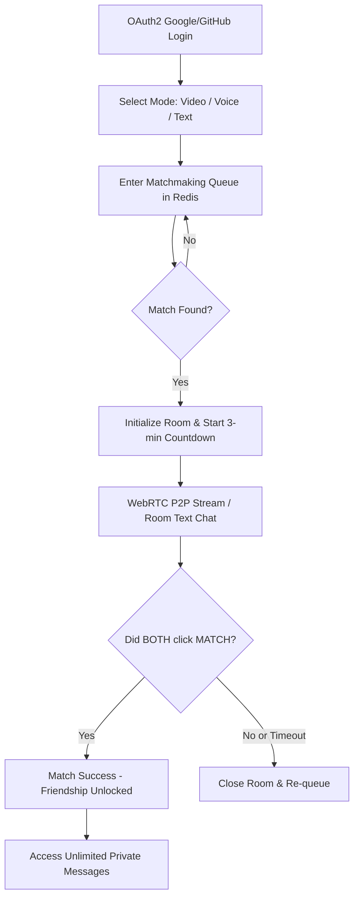

# mitmit - 💬 Live Chat & 3-Minute Blind Date Web App

[](https://www.oracle.com/java/)
[](https://spring.io/projects/spring-boot)
[](https://react.dev/)
[](https://vitejs.dev/)
[](https://tailwindcss.com/)
[](https://github.com/pmndrs/zustand)
[](https://webrtc.org/)
[](LICENSE)

A modern, real-time communication platform combining the random pairing of OmeTV with the matchmaking mechanisms of dating applications.

> **Project Status:** 🚀 The project is currently pending production deployment on a dedicated physical server (not a VPS) for optimal performance and WebRTC stability.

---

## 1. Project Overview

**mitmit** is a modern real-time communication platform that connects users randomly via Video, Voice, or Text. The platform introduces a unique **"3-Minute Blind Date"** concept:
- **Anonymity & Limits:** Initial connections are strictly time-limited to 3 minutes (180 seconds) and partially anonymous.
- **The Match Decision:** Within this time, both users must click the "Heart" button (Match) to express consent.
- **Unlocked Friendship:** If a mutual Match occurs, the 3-minute limit is lifted, the users are added as friends, and unlimited Private Messaging (Inbox) is unlocked.
- **Auto-Disconnect:** If the timer runs out without a mutual Match, the connection is closed, and users return to the matchmaking queue.
- **Safety First:** Logins are mandatory via Google or GitHub OAuth2 (100% identity verification) to ensure a safe and respectful user experience.

---

## 2. Core User Workflow



---

## 3. Features Breakdown

### 3.1. Authentication & Identity
- **OAuth2 Login:** Secure registration and sign-in via Google and GitHub.
- No Guest Mode is permitted to prevent anonymous abuse and maintain accountability.

### 3.2. Random Matchmaking & Room Chat
- **Three Connection Modes:** Video Chat (WebRTC video + audio), Voice Chat (audio-only), and Text Chat.
- **Parallel Text Chat:** Allows typing while video/voice calling. Messages are cached in Redis and destroyed immediately upon room termination.
- **Synchronized Timer:** A 180-second countdown synchronized between clients via WebSockets.

### 3.3. Private Messaging (Inbox)
- **Friends Inbox:** Access restricted to successfully matched contacts.
- **Rich Media Support:** Send text, images, and audio messages (Voice Notes).
- **Interactive Messaging:** Drop Emoji reactions, recall sent messages (Unsend) for both sides, Unfriend, or Block users.

### 3.4. User Feedback Loop (Survey System)
- **Automatic Triggers:** Rating modals pop up automatically based on the user's successful match count.
- **Survey Interval:** Triggers after the **first 3 matches**, then recurs every **10 matches** thereafter (13th, 23rd, 33rd, etc.).
- Collects 1-5 star ratings, problem tags (e.g., lag, bad behavior), and written feedback.

### 3.5. Text Moderation & Anti-Spam
- **Automated Profanity & URL Filter:** Messages are checked using Regex and keyword blacklists. Violating texts are masked with `***` or blocked.
- **Strike System:** Users attempting to send banned words/links multiple times receive strikes. Exceeding 3 strikes flags the user on the Admin Dashboard.
- **Auto-Mute:** If reported for toxic language/spam, the user is instantly muted (`isMuted` set to true) pending manual admin review.

### 3.6. Zero-Tolerance & Trust & Safety Policy
- Zero tolerance for nudity, sexual content (NSFW), or violence.
- **Client-Side AI:** Frontend machine learning models analyze video frames in real-time.
- **Instant Actions:** Violations immediately terminate WebRTC streams, kick the user, trigger a permanent account & device IP ban, and notify the user via email.

---

## 4. Technical Architecture & Resilience

### ⚡ Backend (Spring Boot)
- **Java 21** & **Spring Boot 4.0.6**.
- **Spring Security & OAuth2 Client:** Secures endpoints and handles logins.
- **Invisible JWT Authentication:** JWT tokens are strictly stored in `HttpOnly` Cookies to prevent XSS and URL leakage.
- **Spring Web & Spring WebSocket:** REST API routing and STOMP signaling (configured with Heartbeats for persistent connections).
- **Graceful Shutdown:** 30s timeout configured to protect database transactions during deployments.
- **Log Rotation:** SLF4J integrated with `logback-spring.xml` (RollingFileAppender max 10MB/file, 30 days retention) for clean production logs.
- **Lombok:** Standard boilerplate reduction. AVOID `@Data` on JPA entities to prevent infinite recursion.

### 🎨 Frontend (React + Vite)
- **Vite 8.0** & **React 19.2**.
- **Tailwind CSS 4.2:** Styled as a clean, premium Dark Mode interface.
- **Zustand 5.0:** Lightweight global store management divided into slices (`authSlice`, `matchSlice`, etc.).
- **SockJS & @stomp/stompjs:** Handles WebSocket frames (No Socket.io used).
- **WebRTC Native APIs:** Enables real-time P2P media streams.

### 🗄️ Database & Cache Layers
- **MySQL:** Stores relational tables (Users, Friendships, Reports, Blocks). Primary keys use UUID (`VARCHAR(36)`).
- **MongoDB:** Stores document data (Chat Sessions, Chat History, Private Messages, User Feedback).
- **Redis (Anti-DDoS & Queue):** Fast queue operations for matchmaking. Scheduled loops strictly check queue size (`size < 2`) before executing to prevent CPU exhaustion. Also handles room message cache and temporary blacklists.

---

## 5. Directory Structure

```text
mitmit/
├── backend/                  # Spring Boot Maven Project
│   ├── src/main/java/com/mitmit/
│   │   ├── config/           # Security, WebSocket, Redis & Mongo configurations
│   │   ├── controller/       # Web APIs (User, Friend, Message, Matchmaking, Signaling, Stats)
│   │   ├── document/         # MongoDB documents (ChatSession, Message, Feedback)
│   │   ├── dto/              # Data Transfer Objects
│   │   ├── entity/           # MySQL JPA Entities (User, Friendship, Report, Block)
│   │   ├── service/          # Business Logic (Matchmaking, Room, Friendship, Message, Redis)
│   │   └── DemoApplication.java
│   └── pom.xml
│
├── frontend/                 # React Vite Client
│   ├── src/
│   │   ├── api/              # API clients (axiosClient, socketClient, webRTCClient)
│   │   ├── components/       # Common reusable UI components
│   │   ├── features/         # Feature-based pages (auth, chat, inbox, profile)
│   │   ├── store/            # Zustand store & state slices (authSlice, matchSlice, etc.)
│   │   ├── utils/            # Translation dictionary, string/time helpers
│   │   ├── App.jsx           # Main routing & layout controller
│   │   └── main.jsx          # Entry point
│   ├── package.json
│   └── vite.config.js
│
└── README.md
```

---

## 6. Local Setup

### 6.1. Prerequisites
- **JDK 21**
- **Node.js 20+** & **npm**
- **MySQL 8+**, **MongoDB 6+**, **Redis 7+** (You can use Docker to spin these up quickly)

### 6.2. Backend Setup
1. Open the MySQL console and create the database:
   ```sql
   CREATE DATABASE mitmit CHARACTER SET utf8mb4 COLLATE utf8mb4_unicode_ci;
   ```
2. Navigate to `backend/src/main/resources/`, and copy the example configuration:
   ```bash
   cp application.yaml.example application.yaml
   ```
3. Open `application.yaml` and fill in the required API keys:
   - **OAuth2:** Create an OAuth app on [Google Cloud Console](https://console.cloud.google.com/) and [GitHub Developer Settings](https://github.com/settings/developers) with the callback URI `http://localhost:8080/login/oauth2/code/{google|github}`.
   - **Cloudinary:** Sign up for a free [Cloudinary](https://cloudinary.com/) account to get your cloud name, API key, and secret for media storage.
   - **Email:** If you want email features, generate an App Password from your Google Account.
4. Run the Spring Boot application:
   ```bash
   cd backend
   mvn spring-boot:run
   ```

### 6.3. Frontend Setup
1. Navigate to the `frontend` folder and install dependencies:
   ```bash
   cd frontend
   npm install
   ```
2. Create a `.env` file from the example (if available) or create a new one:
   ```bash
   echo "VITE_API_URL=http://localhost:8080" > .env
   ```
3. Launch the development server:
   ```bash
   npm run dev
   ```
4. Access the web app in your browser (defaults to `http://localhost:5173` or `http://localhost:3000`).

---

## 7. Development Rules (AGENTS.md)
*For AI and Developers collaborating on this codebase:*

- **Read Before Write:** Analyze existing codebase architecture (`frontend/src` or `backend/src`) before adding files.
- **Pure Dark Mode:** The app is strictly "mitmit" - a dark-mode-centric experience. Avoid adding default light mode classes unless requested.
- **Zero Hallucination:** Do NOT add arbitrary features such as Coins, Wallet balances, or Free Chat limits.
- **Zero Placeholders:** Never write comments like `// ... existing code`. Always write 100% complete and fully implemented code.
- **React Components:** Must remain under 150 lines. Modularize logic using custom hooks or child components.
- **JPA Entities:** Avoid `@Data` annotation on JPA classes. Use `@Getter`, `@Setter`, and `@Builder` to avoid infinite toString/hashCode recursions.
- **WebRTC & Real-time:** Use native WebRTC APIs and STOMP over WebSocket (no Socket.io).
